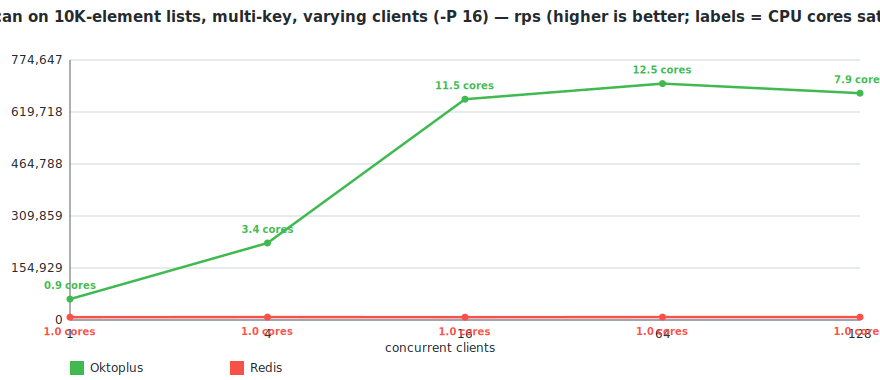
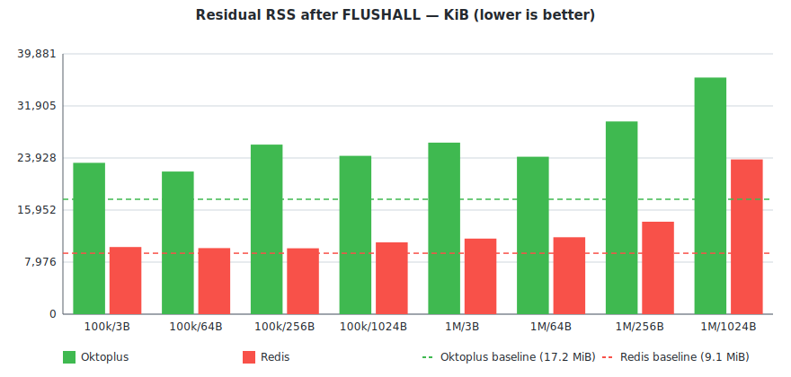

# oktoplus

###### What is oktoplus
Oktoplus is a in-memory data store K:V where V is a container: std::list, std::map, boost::multi_index_container, std::set, you name it. Doing so the client can choose the best container for his own access data pattern.

If this reminds you of REDIS then you are right, I was inspired by it, however:

 - Redis is not multithread
 - Redis offers only basic containers
 - For instance the Redis command LINDEX is O(n), so if you need to access a value with an index would be better to use a Vector style container
  - There is no analogue of multi-set in Redis

Redis Commands Compatibility (gRPC / RESP)

  - [LISTS](docs/compatibility_lists.md) — 76% / 86% (16 / 18 of 21; BLMPOP / BLMOVE / BRPOPLPUSH TBD)
  - [SETS](docs/compatibility_sets.md) — 18% / 94% (3 gRPC, 16 RESP of 17)
  - [STRINGS](docs/compatibility_strings.md) — 0% / 0%

**Oktoplus** specific containers (already implemented, see specific documentation)

  - [DEQUES](docs/deques.md)
  - [VECTORS](docs/vectors.md)

#### Wire protocols

The server exposes the same data through two interfaces:

  - **gRPC** (default port `50051`) — see `src/Libraries/Commands/commands.proto`. Use it to generate a client in your favourite language. Includes admin RPCs `flushAll` / `flushDb` plus all the list / set / deque / vector commands.
  - **RESP** (default port `6379`, optional) — wire-compatible with Redis, so existing tooling like `redis-cli` and `redis-benchmark` works out of the box. Enabled by setting `service.resp_endpoint` in the JSON config. Plus the admin commands `FLUSHDB` / `FLUSHALL`.

The per-family compatibility tables ([LISTS](docs/compatibility_lists.md), [SETS](docs/compatibility_sets.md), [STRINGS](docs/compatibility_strings.md)) include a column showing which Redis commands are wired to gRPC and to RESP today.

Server is multithread, two different clients working on different containers (type or name) have a minimal interaction. For example multiple clients performing a parallel batch insert on different keys can procede in parallel without blocking each other.

#### Benchmarks

A scripted comparison against Redis on the same machine lives at `benchmark_results/` (script: `benchmark_results/run_benchmark.sh`). It starts both servers itself, runs `redis-benchmark` at single-client `-P 1`/`-P 16` and at varying concurrency `-c 1..200`, and dumps CSVs into `benchmark_results/raw/`.

Each `redis-benchmark` invocation runs **N iterations** (env var `ITERATIONS`, default 1; the published numbers below use **N=5**) and the published cell is the **median rps** across them. The harness flags any test whose `max/min > 1.5×` to separate signal from noise: single-run measurements understate random-key throughput because the first iteration pays cold-start costs.

Hardware: AMD EPYC Genoa devserver. Build: `-O3 -march=native -mtune=native -ffast-math -fno-semantic-interposition -funroll-loops`, linked against `jemalloc` (see `OKTOPLUS_WITH_JEMALLOC` in CMake). Workload: 100k ops/iteration, 100k key-space, single client unless stated otherwise.

> Charts are generated from `benchmark_results/raw/*.csv` by `benchmark_results/make_chart.py` (no dependencies — pure-stdlib Python emitting SVG + HTML).
>
> An interactive Chart.js dashboard with the same data lives at [`benchmark_results/report.html`](benchmark_results/report.html) — view it rendered through [htmlpreview.github.io](https://htmlpreview.github.io/?https://github.com/kalman5/oktoplus/blob/master/benchmark_results/report.html).

##### Single client, no pipelining (`-P 1`)

| Test          | Oktoplus rps | Redis rps | Okto / Redis |
|---------------|-------------:|----------:|-------------:|
| LPUSH         |       32,020 |    30,460 |     **105%** |
| SADD          |       32,331 |    29,949 |     **108%** |
| LRANGE_100    |       26,702 |    24,808 |     **108%** |
| LPOP (rand)   |       31,133 |    30,358 |     **103%** |
| RPOP (rand)   |       31,646 |    30,221 |     **105%** |
| LLEN (rand)   |       30,779 |    29,551 |     **104%** |
| SCARD (rand)  |       31,516 |    30,358 |     **104%** |

##### Single client, pipelined (`-P 16`)

| Test          | Oktoplus rps | Redis rps | Okto / Redis |
|---------------|-------------:|----------:|-------------:|
| LPUSH         |      423,729 |   418,410 |     **101%** |
| SADD          |      393,701 |   350,877 |     **112%** |
| LPUSH (LRANGE seed) | 448,430 |   375,940 |     **119%** |
| LRANGE_100    |      124,378 |   111,982 |     **111%** |
| RPUSH (rand)  |      354,610 |   330,033 |     **107%** |
| LPOP (rand)   |      373,134 |   338,983 |     **110%** |
| RPOP (rand)   |      381,679 |   377,358 |     **101%** |
| LLEN          |      431,034 |   423,729 |     **102%** |
| SCARD         |      476,190 |   389,105 |     **122%** |

##### Many clients, no pipelining — LPUSH on a hot key

`-P 1` with varying `-c`.

| Clients | Oktoplus rps | Redis rps | Okto / Redis |
|--------:|-------------:|----------:|-------------:|
|       1 |       32,457 |    31,230 |     **104%** |
|      10 |       72,833 |    86,430 |          84% |
|      50 |       72,254 |    95,694 |          76% |
|     100 |       74,019 |    80,775 |          92% |
|     200 |       77,640 |    80,192 |          97% |

##### Many clients, pipelined, random keys

`-c N` with `-P 16` and `__rand_int__` keys (different clients → different keys → different per-key mutexes). RPUSH at varying concurrency:

A slice from `concurrent_random_*_p16.csv` at `-c 100`:

| Test            | Oktoplus rps | Redis rps | Okto / Redis |
|-----------------|-------------:|----------:|-------------:|
| RPUSH (rand)    |    1,123,596 |   909,091 |     **124%** |
| LPOP (rand)     |    1,041,667 |   917,431 |     **114%** |
| RPOP (rand)     |    1,000,000 | 1,041,667 |          96% |
| LLEN (rand)     |    1,098,901 | 1,149,425 |          96% |
| SADD (rand)     |    1,020,408 |   980,392 |     **104%** |
| SCARD (rand)    |    1,030,928 | 1,030,928 |         100% |

##### Multi-key, CPU-heavy commands — parallelism advantage

Random-key push/pop workloads at `-c 100 -P 16` saturate around ~1M rps for both servers because each command is short and command throughput is bounded by network and parsing, not by command CPU. The picture changes when the per-command CPU work dominates: with **`LPOS key:__rand_int__ <missing-value>` against pre-populated lists**, every call walks the whole list (10K elements ≈ ~100µs of CPU per call) while sending only ~5 bytes back over the wire. Redis stays capped at one core; Oktoplus's per-key sharding lets the work parallelize across cores.

`LPOS key:__rand_int__ NEVER_PRESENT` against 1000 pre-populated keys, each holding 10,000 distinct elements (`-P 16`):

| Clients | Oktoplus rps | Redis rps | Okto / Redis |
|--------:|-------------:|----------:|-------------:|
|       1 |       62,305 |     8,457 |    **7.4×**  |
|       4 |      208,333 |     8,547 |   **24.4×**  |
|      16 |      588,235 |     8,643 |   **68.1×**  |
|      64 |      588,235 |     8,666 |   **67.9×**  |
|     128 |      689,655 |     8,595 |   **80.2×**  |

Bench script: `benchmark_results/run_parallelism_advantage_bench.sh`. The same workload at smaller `N=1000` (10× shorter scans) reaches ~13× at `-c 128`; at smaller `-P 1` the network RTT eats most of the per-command CPU advantage and the ratio collapses to ~1.5×.

##### Single client, pipelined (`-P 16`), 256-byte values

Same workload as the small-value `-P 16` table above but with a 256-byte payload (`-d 256` for built-ins, a 256-byte literal on the custom RPUSH).

| Test          | Oktoplus rps | Redis rps | Okto / Redis |
|---------------|-------------:|----------:|-------------:|
| LPUSH         |      403,226 |   361,011 |     **112%** |
| SADD          |      421,941 |   354,610 |     **119%** |
| LPUSH (LRANGE seed) | 398,406 |   344,828 |     **116%** |
| LRANGE_100    |       54,289 |    53,562 |     **101%** |
| RPUSH (rand, 256B) | 296,736 |   305,810 |          97% |
| LPOP (rand)   |      349,650 |   315,457 |     **111%** |
| RPOP (rand)   |      400,000 |   374,532 |     **107%** |
| LLEN          |      429,185 |   389,105 |     **110%** |
| SCARD         |      483,092 |   436,681 |     **111%** |

Full per-test CSVs and the raw-results history are under `benchmark_results/raw/`.

##### Memory footprint

Generated by `benchmark_results/run_memory.sh` — for each cell, start a fresh server, snapshot RSS, load N distinct keys via `RPUSH key:i <value>` over `redis-cli --pipe`, snapshot RSS again. `bytes/key = (steady - baseline) * 1024 / N`.

| N keys     | value | Oktoplus bytes/key | Redis bytes/key | Okto / Redis |
|-----------:|------:|-------------------:|----------------:|-------------:|
|   100,000  |    3B |                172 |              70 |        2.5×  |
|   100,000  |   64B |                253 |             135 |        1.9×  |
|   100,000  |  256B |                494 |             378 |        1.3×  |
|   100,000  | 1024B |              1,461 |           1,342 |        1.1×  |
| 1,000,000  |    3B |                222 |              72 |        3.1×  |
| 1,000,000  |   64B |                305 |             133 |        2.3×  |
| 1,000,000  |  256B |                546 |             375 |        1.5×  |
| 1,000,000  | 1024B |              1,514 |           1,345 |        1.1×  |

Per-key fixed overhead (extrapolated from the 3-byte rows where the value cost is negligible) is **~70 B** for Redis and **~170-220 B** for Oktoplus. The gap shrinks as the value grows: 2.4× at 3B (100k), 1.9× at 64B, 1.3× at 256B, essentially **at parity** (1.1×) at 1 KB. Full per-trial CSVs at `benchmark_results/raw/memory.csv`, full table at `benchmark_results/memory_results.md`.

##### Residual memory after FLUSHALL

`FLUSHALL` and `FLUSHDB` clear every container and then call jemalloc's `mallctl("arena.<all>.purge")` to return dirty pages to the OS, so post-flush RSS lands close to baseline instead of stalling at the steady-state high-water mark.

| N keys     | value | Oktoplus residual (KiB) | Redis residual (KiB) |
|-----------:|------:|------------------------:|---------------------:|
|   100,000  |    3B |                  26,900 |                9,680 |
|   100,000  |   64B |                  27,548 |               10,040 |
|   100,000  |  256B |                  28,596 |               10,388 |
|   100,000  | 1024B |                  27,888 |               11,000 |
| 1,000,000  |    3B |                  29,852 |               11,544 |
| 1,000,000  |   64B |                  30,312 |               11,796 |
| 1,000,000  |  256B |                  31,604 |               14,200 |
| 1,000,000  | 1024B |                  38,824 |               23,720 |

Baseline RSS is ~21 MiB for Oktoplus and ~9 MiB for Redis; *delta over baseline* (truly retained allocator memory) is ~6–17 MiB on Oktoplus vs ~1–14 MiB on Redis across the workload sweep.

#### Where Oktoplus wins

  - **Container choice matches access pattern.** Native [vectors](docs/vectors.md) give O(1) `INDEX` (Redis's `LINDEX` is O(n)). Multi-set and multi-map are first-class. `boost::multi_index_container` with up to 3 keys is on the roadmap. You pick the container; you don't reshape your data to fit a list or hash.
  - **Concurrent writers on different keys actually run in parallel.** The keyspace is split across 32 shards, each key has its own mutex. A workload of N writers touching N different keys uses N cores — not one. Redis 7's I/O threads parallelise socket reads/writes but command execution is single-threaded.
  - **CPU-bound multi-key workloads scale across cores.** When the per-command CPU dominates wire bytes (e.g. `LPOS key:__rand_int__ <missing>` scanning 10K-element lists), Redis caps at ~8.5K rps (one core) while Oktoplus reaches ~690K rps at `-c 128 -P 16` — **80× faster**. See the parallelism-advantage table above.
  - **Hot-key, read, and random-key throughput all beat Redis** at every value size benchmarked (see tables above). At single-client `-P 16`: LPUSH 101% small / 112% on 256-byte values; SADD/LLEN/SCARD 102–122%; random-key RPUSH/LPOP/RPOP 101–114%; LRANGE_100 111% small / 101% on 256-byte. At `-c 100 -P 16` random-key: RPUSH 124%, LPOP 114%, SADD 104%.
  - **Native gRPC alongside RESP.** Generate a typed client in any language straight from `commands.proto` — no need to (re)implement the wire protocol. Existing Redis tooling (`redis-cli`, `redis-benchmark`) still works on the RESP port.

#### What it doesn't do (yet)

  - No replication, clustering, or persistence — see the release plan below.
  - No pub/sub, streams, scripting, or transactions.
  - Command coverage: lists 76%, sets 94% on RESP / 18% on gRPC, strings 0% — see the per-family compatibility tables linked at the top.
  - Hot-key LPUSH at high concurrency without pipelining (`-P 1`) trails Redis by ~3–24% (network round-trip per command dominates and Oktoplus's per-command path is slightly heavier than Redis's hand-tuned single-threaded loop). With pipelining (`-P 16`), the same workload reaches Redis-parity (~1M rps both servers).
  - **Per-key memory overhead is ~2-3× Redis at small values** (~170 B vs 70 B), reaching parity at 1 KB. SDS-style packed keys/values (PERF_TODO item A) would close the remaining steady-state gap.
  - Single-node, no production deployments.

#### Release plan
- Support all REDIS commands (at least the one relative to data storage)
- Support the following containers: deque, list, map, multimap, multiset, set, unorderd_map, unordered_multimap, vector, boost::multi_index (up to at least 3 keys)
- Make it distributed using RAFT as consensus protocol

***

[How To Build](docs/howtobuild.md)

*** 
