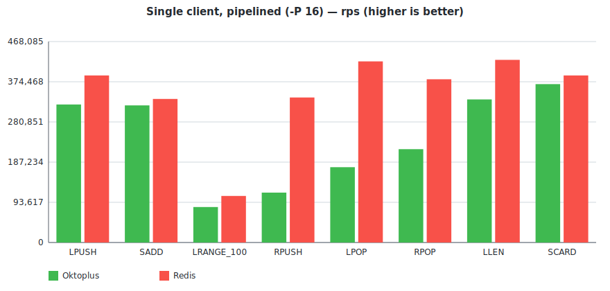
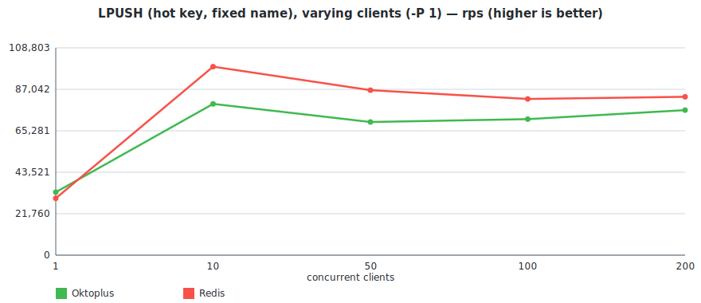

# oktoplus

###### What is oktoplus
Oktoplus is a in-memory data store K:V where V is a container: std::list, std::map, boost::multi_index_container, std::set, you name it. Doing so the client can choose the best container for his own access data pattern.

If this reminds you of REDIS then you are right, I was inspired by it, however:

 - Redis is not multithread
 - Redis offers only basic containers
 - For instance the Redis command LINDEX is O(n), so if you need to access a value with an index would be better to use a Vector style container
  - There is no analogue of multi-set in Redis

Redis Commands Compatibility

  - [LISTS](docs/compatibility_lists.md) 76% Completed
  - [SETS](docs/compatibility_sets.md) 18% Completed
  - [STRINGS](docs/compatibility_strings.md) 0% Completed

**Oktoplus** specific containers (already implemented, see specific documentation)

  - [DEQUES](docs/deques.md)
  - [VECTORS](docs/vectors.md)

#### Wire protocols

The server exposes the same data through two interfaces:

  - **gRPC** (default port `50051`) — see `src/Libraries/Commands/commands.proto`. Use it to generate a client in your favourite language. Includes admin RPCs `flushAll` / `flushDb` plus all the list / set / deque / vector commands.
  - **RESP** (default port `6379`, optional) — wire-compatible with Redis, so existing tooling like `redis-cli` and `redis-benchmark` works out of the box. Enabled by setting `service.resp_endpoint` in the JSON config.

Currently implemented RESP commands include `PING`, `QUIT`, `INFO`, `SELECT`, `CLIENT`, `COMMAND`, `FLUSHDB`, `FLUSHALL`, the list family (`LPUSH`/`RPUSH`/`LPUSHX`/`RPUSHX`/`LPOP`/`RPOP`/`LLEN`/`LINDEX`/`LINSERT`/`LRANGE`/`LREM`/`LSET`/`LTRIM`/`LMOVE`/`LPOS`/`LMPOP`), and the set family (`SADD`/`SCARD`/`SDIFF`/`SDIFFSTORE`/`SINTER`/`SINTERCARD`/`SINTERSTORE`/`SISMEMBER`/`SMISMEMBER`/`SMEMBERS`/`SMOVE`/`SPOP`/`SRANDMEMBER`/`SREM`/`SUNION`/`SUNIONSTORE`).

Server is multithread, two different clients working on different containers (type or name) have a minimal interaction. For example multiple clients performing a parallel batch insert on different keys can procede in parallel without blocking each other.

#### Benchmarks

A scripted comparison against Redis on the same machine lives at `benchmark_results/` (script: `benchmark_results/run_benchmark.sh`). It starts both servers itself, runs `redis-benchmark` at single-client `-P 1`/`-P 16` and at varying concurrency `-c 1..200`, and dumps CSVs into `benchmark_results/raw/`.

Hardware: AMD EPYC Genoa devserver. Build: `-O3 -march=native -mtune=native -ffast-math -fno-semantic-interposition -funroll-loops`. Workload: 100k ops, 100k key-space, single client unless stated otherwise.

> Charts are generated from `benchmark_results/raw/*.csv` by `benchmark_results/make_chart.py` (no dependencies — pure-stdlib Python emitting SVG).

##### Single client, no pipelining (`-P 1`) — both servers tied

At pipeline depth 1 the workload is dominated by the kernel network round-trip, not the server. Oktoplus and Redis are within run-to-run noise.

| Test          | Oktoplus rps | Redis rps | Okto / Redis |
|---------------|-------------:|----------:|-------------:|
| LPUSH         |       32,082 |    31,230 |         103% |
| SADD          |       30,460 |    29,334 |         104% |
| LRANGE_100    |       24,131 |    24,673 |          98% |
| LPOP (rand)   |       28,289 |    30,883 |          92% |
| RPOP (rand)   |       28,927 |    31,949 |          91% |
| LLEN (rand)   |       30,836 |    31,133 |          99% |
| SCARD (rand)  |       32,031 |    30,836 |         104% |

##### Single client, pipelined (`-P 16`) — Oktoplus 78–100% of Redis

Pipelining lets each server stretch its legs. Both servers are CPU-bound here; Redis's hand-tuned C still wins on the write paths but Oktoplus closes most of the gap and ties on `SCARD`.

| Test          | Oktoplus rps | Redis rps | Okto / Redis |
|---------------|-------------:|----------:|-------------:|
| LPUSH         |      317,460 |   404,858 |          78% |
| SADD          |      277,008 |   333,333 |          83% |
| LRANGE_100    |       82,850 |   103,520 |          80% |
| LPOP (rand)   |      193,798 |   348,432 |          56% |
| RPOP (rand)   |      215,517 |   420,168 |          51% |
| LLEN (rand)   |      358,423 |   384,615 |          93% |
| SCARD (rand)  |      390,625 |   389,105 |         100% |

##### Many clients, no pipelining — LPUSH on a hot key

The "parallelism" sweep keeps `-P 1` and varies `-c`. Both servers saturate around 10 clients on a hot key (one TCP connection per client; everything serializes on the inner mutex / single-thread loop respectively).

| Clients | Oktoplus rps | Redis rps | Okto / Redis |
|--------:|-------------:|----------:|-------------:|
|       1 |       31,556 |    30,451 |         104% |
|      10 |       81,169 |    99,108 |          82% |
|      50 |       71,891 |    83,893 |          86% |
|     100 |       69,784 |    83,963 |          83% |
|     200 |       70,028 |    86,505 |          81% |

Full per-test CSVs and the raw-results history are under `benchmark_results/raw/`.

#### Release plan
- Support all REDIS commands (at least the one relative to data storage)
- Support the following containers: deque, list, map, multimap, multiset, set, unorderd_map, unordered_multimap, vector, boost::multi_index (up to at least 3 keys)
- Make it distributed using RAFT as consensus protocol

***

[How To Build](docs/howtobuild.md)

*** 
