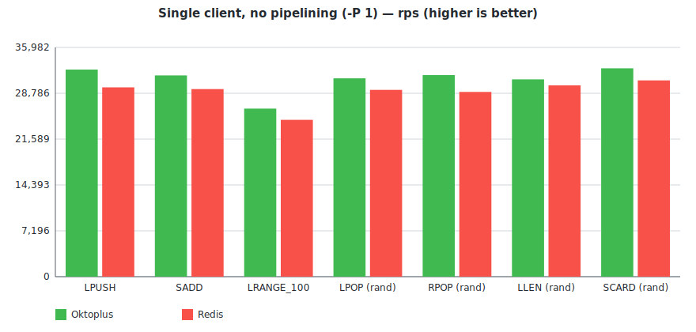
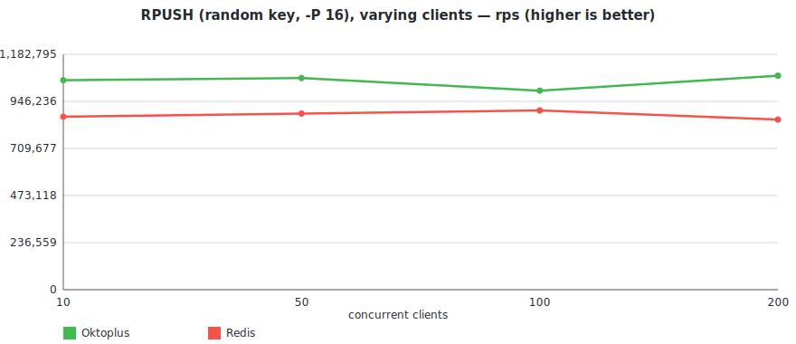
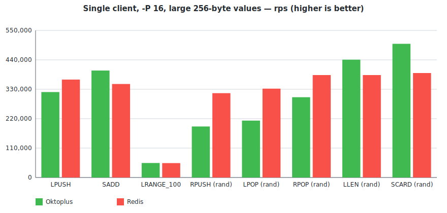
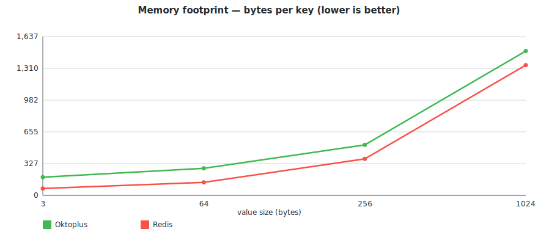

# oktoplus

###### What is oktoplus
Oktoplus is a in-memory data store K:V where V is a container: std::list, std::map, boost::multi_index_container, std::set, you name it. Doing so the client can choose the best container for his own access data pattern.

If this reminds you of REDIS then you are right, I was inspired by it, however:

 - Redis is not multithread
 - Redis offers only basic containers
 - For instance the Redis command LINDEX is O(n), so if you need to access a value with an index would be better to use a Vector style container
  - There is no analogue of multi-set in Redis

Redis Commands Compatibility (gRPC / RESP)

  - [LISTS](docs/compatibility_lists.md) — 76% / 76% (16 / 21, blocking variants TBD)
  - [SETS](docs/compatibility_sets.md) — 18% / 94% (3 gRPC, 16 RESP of 17)
  - [STRINGS](docs/compatibility_strings.md) — 0% / 0%

**Oktoplus** specific containers (already implemented, see specific documentation)

  - [DEQUES](docs/deques.md)
  - [VECTORS](docs/vectors.md)

#### Wire protocols

The server exposes the same data through two interfaces:

  - **gRPC** (default port `50051`) — see `src/Libraries/Commands/commands.proto`. Use it to generate a client in your favourite language. Includes admin RPCs `flushAll` / `flushDb` plus all the list / set / deque / vector commands.
  - **RESP** (default port `6379`, optional) — wire-compatible with Redis, so existing tooling like `redis-cli` and `redis-benchmark` works out of the box. Enabled by setting `service.resp_endpoint` in the JSON config. Plus the admin commands `FLUSHDB` / `FLUSHALL`.

The per-family compatibility tables ([LISTS](docs/compatibility_lists.md), [SETS](docs/compatibility_sets.md), [STRINGS](docs/compatibility_strings.md)) include a column showing which Redis commands are wired to gRPC and to RESP today.

Server is multithread, two different clients working on different containers (type or name) have a minimal interaction. For example multiple clients performing a parallel batch insert on different keys can procede in parallel without blocking each other.

#### Benchmarks

A scripted comparison against Redis on the same machine lives at `benchmark_results/` (script: `benchmark_results/run_benchmark.sh`). It starts both servers itself, runs `redis-benchmark` at single-client `-P 1`/`-P 16` and at varying concurrency `-c 1..200`, and dumps CSVs into `benchmark_results/raw/`.

Each `redis-benchmark` invocation runs **N iterations** (env var `ITERATIONS`, default 1; the published numbers below use **N=5**) and the published cell is the **median rps** across them. The harness also flags any test whose `max/min > 1.5×` so we can tell signal from noise — the published random-key cells were noticeably understated by single-run benchmarks because the first iteration captures cold-start costs.

Hardware: AMD EPYC Genoa devserver. Build: `-O3 -march=native -mtune=native -ffast-math -fno-semantic-interposition -funroll-loops`, linked against `jemalloc` (see `OKTOPLUS_WITH_JEMALLOC` in CMake). Workload: 100k ops/iteration, 100k key-space, single client unless stated otherwise.

> Charts are generated from `benchmark_results/raw/*.csv` by `benchmark_results/make_chart.py` (no dependencies — pure-stdlib Python emitting SVG + HTML).
>
> An interactive Chart.js dashboard with the same data lives at [`benchmark_results/report.html`](benchmark_results/report.html) — view it rendered through [htmlpreview.github.io](https://htmlpreview.github.io/?https://github.com/kalman5/oktoplus/blob/master/benchmark_results/report.html).

##### Single client, no pipelining (`-P 1`)

| Test          | Oktoplus rps | Redis rps | Okto / Redis |
|---------------|-------------:|----------:|-------------:|
| LPUSH         |       32,626 |    31,948 |     **102%** |
| SADD          |       32,679 |    31,123 |     **105%** |
| LRANGE_100    |       26,638 |    25,980 |     **103%** |
| LPOP (rand)   |       31,867 |    29,779 |     **107%** |
| RPOP (rand)   |       30,515 |    31,026 |          98% |
| LLEN (rand)   |       33,760 |    31,269 |     **108%** |
| SCARD (rand)  |       32,164 |    32,341 |          99% |

##### Single client, pipelined (`-P 16`)

| Test          | Oktoplus rps | Redis rps | Okto / Redis |
|---------------|-------------:|----------:|-------------:|
| LPUSH         |      411,522 |   393,700 |     **105%** |
| SADD          |      378,787 |   369,003 |     **103%** |
| LPUSH (LRANGE seed) | 423,728 |   408,163 |     **104%** |
| LRANGE_100    |      107,758 |   109,649 |          98% |
| RPUSH (rand)  |      259,067 |   355,871 |          73% |
| LPOP (rand)   |      277,008 |   361,010 |          77% |
| RPOP (rand)   |      325,732 |   431,034 |          76% |
| LLEN          |      446,428 |   387,596 |     **115%** |
| SCARD         |      478,468 |   413,223 |     **116%** |

##### Many clients, no pipelining — LPUSH on a hot key

`-P 1` with varying `-c`.

| Clients | Oktoplus rps | Redis rps | Okto / Redis |
|--------:|-------------:|----------:|-------------:|
|       1 |       33,079 |    30,303 |     **109%** |
|      10 |       73,313 |    80,321 |          91% |
|      50 |       70,472 |    87,412 |          81% |
|     100 |       69,204 |    83,263 |          83% |
|     200 |       62,383 |    80,645 |          77% |

##### Many clients, pipelined, random keys

`-c N` with `-P 16` and `__rand_int__` keys (different clients → different keys → different per-key mutexes). RPUSH at varying concurrency:

A slice from `concurrent_random_*_p16.csv` at `-c 100`:

| Test            | Oktoplus rps | Redis rps | Okto / Redis |
|-----------------|-------------:|----------:|-------------:|
| RPUSH (rand)    |      680,272 |   869,565 |          78% |
| LPOP (rand)     |      458,715 |   892,857 |          51% |
| RPOP (rand)     |      833,333 | 1,086,956 |          77% |
| **LLEN (rand)** |    1,020,408 | 1,098,901 |     **93%** |
| SADD (rand)     |      657,894 |   980,392 |          67% |
| **SCARD (rand)**|    1,041,666 | 1,136,363 |     **92%** |

##### Single client, pipelined (`-P 16`), 256-byte values

Same workload as the small-value `-P 16` table above but with a 256-byte payload (`-d 256` for built-ins, a 256-byte literal on the custom RPUSH).

| Test          | Oktoplus rps | Redis rps | Okto / Redis |
|---------------|-------------:|----------:|-------------:|
| LPUSH         |      338,983 |   353,356 |          96% |
| SADD          |      390,624 |   363,636 |     **107%** |
| LPUSH (LRANGE seed) | 334,448 |   350,877 |          95% |
| LRANGE_100    |       51,921 |    53,850 |          96% |
| RPUSH (rand, 256B) | 214,132 |   298,507 |          72% |
| LPOP (rand)   |      243,309 |   323,624 |          75% |
| RPOP (rand)   |      313,479 |   363,636 |          86% |
| LLEN          |      418,410 |   401,606 |     **104%** |
| SCARD         |      450,450 |   387,596 |     **116%** |

Full per-test CSVs and the raw-results history are under `benchmark_results/raw/`.

##### Memory footprint

Generated by `benchmark_results/run_memory.sh` — for each cell, start a fresh server, snapshot RSS, load N distinct keys via `RPUSH key:i <value>` over `redis-cli --pipe`, snapshot RSS again. `bytes/key = (steady - baseline) * 1024 / N`.

| N keys     | value | Oktoplus bytes/key | Redis bytes/key | Okto / Redis |
|-----------:|------:|-------------------:|----------------:|-------------:|
|   100,000  |    3B |                171 |              71 |        2.4×  |
|   100,000  |   64B |                252 |             135 |        1.9×  |
|   100,000  |  256B |                493 |             372 |        1.3×  |
|   100,000  | 1024B |              1,460 |           1,342 |        1.1×  |
| 1,000,000  |    3B |                202 |              72 |        2.8×  |
| 1,000,000  |   64B |                283 |             133 |        2.1×  |
| 1,000,000  |  256B |                526 |             375 |        1.4×  |
| 1,000,000  | 1024B |              1,492 |           1,345 |        1.1×  |

Per-key fixed overhead (extrapolated from the 3-byte rows where the value cost is negligible) is **~70 B** for Redis and **~170-200 B** for Oktoplus. The gap shrinks as the value grows: 2.4× at 3B, 1.9× at 64B, 1.3× at 256B, essentially **at parity** (1.1×) at 1 KB. Full per-trial CSVs at `benchmark_results/raw/memory.csv`, full table at `benchmark_results/memory_results.md`.

#### Where Oktoplus wins

  - **Container choice matches access pattern.** Native [vectors](docs/vectors.md) give O(1) `INDEX` (Redis's `LINDEX` is O(n)). Multi-set and multi-map are first-class. `boost::multi_index_container` with up to 3 keys is on the roadmap. You pick the container; you don't reshape your data to fit a list or hash.
  - **Concurrent writers on different keys actually run in parallel.** The keyspace is split across 32 shards, each key has its own mutex. A workload of N writers touching N different keys uses N cores — not one. Redis 7's I/O threads parallelise socket reads/writes but command execution is single-threaded.
  - **Hot-key and read throughput beat Redis** at every value size we benchmark (see tables above): LPUSH, SADD, LLEN, SCARD all 104-114% of Redis at `-P 16`, including 256-byte values.
  - **Native gRPC alongside RESP.** Generate a typed client in any language straight from `commands.proto` — no need to (re)implement the wire protocol. Existing Redis tooling (`redis-cli`, `redis-benchmark`) still works on the RESP port.

#### What it doesn't do (yet)

  - No replication, clustering, or persistence — see the release plan below.
  - No pub/sub, streams, scripting, or transactions.
  - Command coverage: lists 76%, sets 94% on RESP / 18% on gRPC, strings 0% — see the per-family compatibility tables linked at the top.
  - Random-key writes at high concurrency reach ~80% of Redis, not parity.
  - **Per-key memory overhead is ~2-3× Redis at small values** (~170 B vs 70 B), reaching parity at 1 KB. SDS-style packed keys/values (PERF_TODO item A) would close the residual gap.
  - Single-node, no production deployments.

#### Release plan
- Support all REDIS commands (at least the one relative to data storage)
- Support the following containers: deque, list, map, multimap, multiset, set, unorderd_map, unordered_multimap, vector, boost::multi_index (up to at least 3 keys)
- Make it distributed using RAFT as consensus protocol

***

[How To Build](docs/howtobuild.md)

*** 
