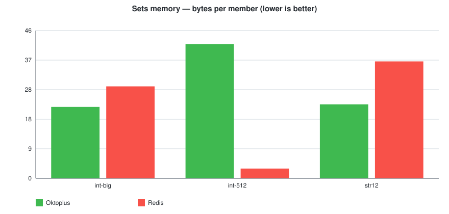

# oktoplus

###### What is oktoplus
Oktoplus is a in-memory data store K:V where V is a container: std::list, std::map, boost::multi_index_container, std::set, you name it. Doing so the client can choose the best container for his own access data pattern.

###### Why try it
**RESP2 wire-compatible with Redis** — point `redis-cli`, `redis-benchmark`, or any existing Redis client at port `6379` and it just works. Drop-in for the read/write path on the supported commands (lists 100%, sets 94%; strings on the roadmap).

**Faster than Redis at the same workload on most cells benchmarked** — single-client `-P 16` runs ~12–49% above the Redis reference across `LPUSH` / `LLEN` / `RPUSH` / `LPOP` / `RPOP` / `SADD`; CPU-heavy multi-key workloads (e.g. `LPOS` scans) reach >100× because command execution is multi-threaded and sharded per key, so N writers on N keys use N cores. See the benchmark tables below for the per-cell numbers.

**Not a drop-in for everything yet.** No persistence, no replication / clustering, no pub/sub / streams / scripting / transactions. If you need Redis as the system of record, stay on Redis; if you need it as a hot in-memory store and want the multi-core scaling and the richer container types (vector with O(1) `INDEX`, multi-set, multi-map, multi-index), Oktoplus is worth a try.

If this reminds you of Redis then you are right — Redis is the inspiration. Oktoplus differs along a few axes that come up repeatedly in the rest of this README:

 - command execution is multi-threaded, sharded per-key
 - the value type is the container itself, picked from a richer set (vector, deque, multi-set, multi-map, multi-index) so the access pattern dictates the data structure
 - that lets, for example, `INDEX` on a vector be O(1) where Redis's `LINDEX` on a list is O(n)
 - it speaks RESP2 on the wire, so existing Redis client libraries and tooling work unchanged

Redis Commands Compatibility (RESP)

  - [LISTS](docs/compatibility_lists.md) — 100% (21 / 21)
  - [SETS](docs/compatibility_sets.md) — 94% (16 / 17)
  - [STRINGS](docs/compatibility_strings.md) — 0%

**Oktoplus** specific containers (already implemented, see specific documentation)

  - [DEQUES](docs/deques.md)
  - [VECTORS](docs/vectors.md)

#### Wire protocols

The server exposes the same data through two interfaces:

  - **RESP2** (default port `6379`, always on) — primary wire protocol, wire-compatible with Redis using the RESP2 framing (`+` `-` `:` `$` `*` types, `$-1\r\n` / `*-1\r\n` nulls), so existing tooling like `redis-cli` and `redis-benchmark` works out of the box. Override the bind address via `service.resp_endpoint` in the JSON config. Includes the admin commands `FLUSHDB` / `FLUSHALL`. RESP3 (`HELLO`-negotiated, native maps/sets/push, unified `_\r\n` null) is on the roadmap — see TODO below.
  - **gRPC** (optional) — see `src/Libraries/Commands/commands.proto`. Use it to generate a client in your favourite language. Includes admin RPCs `flushAll` / `flushDb` plus all the list / set / deque / vector commands. **Disabled by default at build time** to keep baseline RSS down to ~8.5 MiB — pass `-DOKTOPLUS_WITH_GRPC=ON` to cmake to compile it in, then enable at runtime by setting `service.endpoint` in the JSON config.

The per-family compatibility tables ([LISTS](docs/compatibility_lists.md), [SETS](docs/compatibility_sets.md), [STRINGS](docs/compatibility_strings.md)) include a column showing which Redis commands are wired to gRPC and to RESP today.

#### TODO

  - **RESP3 protocol support**: implement `HELLO` for protocol negotiation, gate the per-connection encoder on the negotiated version, swap to the unified `_\r\n` null, and add the new type tags (`#` boolean, `,` double, `(` big number, `=` verbatim string, `~` set, `%` map, `>` push, `|` attribute). Today the server speaks RESP2 only; RESP3-capable clients (e.g. `redis-cli -3`) fall back to RESP2 because `HELLO` returns `ERR unknown command`.

  Memory-footprint techniques on the table for further reducing per-key overhead at small values (all are tricks Redis already applies — closing any of them lowers the bytes-per-key numbers in the memory section below):

  - **embstr encoding**: when a value is ≤44 B, store the `redisObject` header and the SDS in the *same* allocation. One alloc instead of two on the hot path for small values.
  - **listpack encoding** for small lists / hashes / sets: a single contiguous packed buffer of `[backlen, encoding, content]` entries, no per-entry pointer or header overhead. A 1-element small-value list collapses to a single ~25 B allocation vs Oktoplus's `ProtectedContainer + devector + okts::stor::string` chain.
  - **Quicklist** for large lists: linked list of listpack nodes; per-element overhead amortizes to a few bytes inside a node instead of one heap alloc per element.
  - **Shared integer objects**: Redis interns the integers 0..9999 as global singletons. `RPUSH foo 42` doesn't allocate; it stores a pointer to the shared "42" object. Cuts allocation pressure on numeric workloads.
  - **Compact dict**: replace `absl::flat_hash_map`'s control-byte + slot layout (fast but high per-bucket overhead) with a 24-byte `dictEntry`-style separate-chaining hash, possibly with incremental rehashing to bound worst-case stalls.
  - **Lazy-free + activedefrag**: offload deallocation to a background thread (`UNLINK`, `FLUSHDB ASYNC`) and periodically walk the heap using jemalloc's `je_get_defrag_hint` to migrate live objects out of fragmented slabs. Cuts steady-state retained metadata over time.

Server is multithread, two different clients working on different containers (type or name) have a minimal interaction. For example multiple clients performing a parallel batch insert on different keys can procede in parallel without blocking each other.

#### Benchmarks

The benchmarks below run Oktoplus alongside Redis on the same machine as a known reference point — Redis is the system most readers will already have a feel for, so the Redis numbers are included as a yardstick rather than as a leaderboard. The script (`benchmark_results/run_benchmark.sh`) starts both servers itself, runs `redis-benchmark` at single-client `-P 1`/`-P 16` and at varying concurrency `-c 1..200`, and dumps CSVs into `benchmark_results/raw/`.

Each `redis-benchmark` invocation runs **N iterations** (env var `ITERATIONS`, default 1; the published numbers below use **N=5**) and the published cell is the **median rps** across them. The harness flags any test whose `max/min > 1.5×` to separate signal from noise: single-run measurements understate random-key throughput because the first iteration pays cold-start costs.

Each per-cell CSV row also carries a trailing **`server_cpu_pct`** column — the average percent CPU the server consumed across the cell's wall-clock window (read from `/proc/<pid>/stat` utime+stime, divided by the cell duration). Values >100% mean multi-core utilisation: e.g. 1300% = 13 full cores saturated. The companion `chart_parallelism_cpu.svg` plots cores-saturated vs concurrency directly so per-key sharding shows up on a hardware-independent metric. Each CSV is also paired with a `*.config` sidecar describing the exact env-var values that produced it (defaults reproduce the published numbers).

Hardware: AMD EPYC Genoa devserver. Build: `-O3 -march=native -mtune=native -ffast-math -fno-semantic-interposition -funroll-loops`, linked against `jemalloc` (see `OKTOPLUS_WITH_JEMALLOC` in CMake). Workload: 100k ops/iteration, 100k key-space, single client unless stated otherwise.

> Charts are generated from `benchmark_results/raw/*.csv` by `benchmark_results/make_chart.py` (no dependencies — pure-stdlib Python emitting SVG + HTML).
>
> An interactive Chart.js dashboard with the same data lives at [`benchmark_results/report.html`](benchmark_results/report.html) — view it rendered through [htmlpreview.github.io](https://htmlpreview.github.io/?https://github.com/kalman5/oktoplus/blob/master/benchmark_results/report.html).

##### Single client, no pipelining (`-P 1`)

| Test          | Oktoplus rps | Redis rps | Okto / Redis |
|---------------|-------------:|----------:|-------------:|
| LPUSH         |       47,259 |    45,600 |     104% |
| SADD          |       49,407 |    44,209 |     112% |
| LRANGE_100    |       36,670 |    35,336 |     104% |
| LPOP (rand)   |       48,379 |    46,189 |     105% |
| RPOP (rand)   |       51,387 |    47,148 |     109% |
| LLEN (rand)   |       47,870 |    48,662 |          98% |
| SCARD (rand)  |       46,816 |    48,309 |          97% |

##### Single client, pipelined (`-P 16`)

| Test          | Oktoplus rps | Redis rps | Okto / Redis |
|---------------|-------------:|----------:|-------------:|
| LPUSH         |      714,286 |   602,410 |     119% |
| SADD          |      581,395 |   515,464 |     113% |
| LPUSH (LRANGE seed) | 671,141 |   657,895 |     102% |
| LRANGE_100    |      127,065 |   118,203 |     107% |
| RPUSH (rand)  |      505,050 |   452,489 |     112% |
| LPOP (rand)   |      534,759 |   467,290 |     114% |
| RPOP (rand)   |      729,927 |   490,196 |     149% |
| LLEN          |      709,220 |   518,135 |     137% |
| SCARD         |      632,911 |   549,451 |     115% |

##### Many clients, no pipelining — LPUSH on a hot key

`-P 1` with varying `-c`.

| Clients | Oktoplus rps | Redis rps | Okto / Redis |
|--------:|-------------:|----------:|-------------:|
|       1 |       47,939 |    48,614 |          99% |
|      10 |      104,384 |   154,321 |          68% |
|      50 |      116,550 |   158,228 |          74% |
|     100 |      126,263 |   145,985 |          86% |
|     200 |      110,375 |   143,678 |          77% |

##### Many clients, pipelined, random keys

`-c N` with `-P 16` and `__rand_int__` keys (different clients → different keys → different per-key mutexes). RPUSH at varying concurrency:

A slice from `concurrent_random_*_p16.csv` at `-c 100`:

| Test            | Oktoplus rps | Redis rps | Okto / Redis |
|-----------------|-------------:|----------:|-------------:|
| RPUSH (rand)    |    1,449,275 | 1,086,956 |     133% |
| LPOP (rand)     |    1,428,571 | 1,204,819 |     119% |
| RPOP (rand)     |    1,515,152 | 1,408,451 |     108% |
| LLEN (rand)     |    1,492,537 | 1,515,152 |          99% |
| SADD (rand)     |    1,470,588 | 1,282,051 |     115% |
| SCARD (rand)    |    1,492,537 | 1,333,333 |     112% |

##### Multi-key, CPU-heavy commands — per-key sharding

Random-key push/pop workloads at `-c 100 -P 16` saturate around ~1M rps for both servers because each command is short and command throughput is bounded by network and parsing, not by command CPU. The picture changes when the per-command CPU work dominates: with **`LPOS key:__rand_int__ <missing-value>` against pre-populated lists**, every call walks the whole list (10K elements ≈ ~100µs of CPU per call) while sending only ~5 bytes back over the wire. Per-key sharding lets the work parallelize across cores; the Redis line on the same chart is the natural reference point for a single-threaded execution model.

`LPOS key:__rand_int__ NEVER_PRESENT` against 1000 pre-populated keys, each holding 10,000 distinct elements (`-P 16`). The `cores` columns are `server_cpu_pct / 100` averaged over the cell — i.e. how many full CPU cores the server saturated:

| Clients | Oktoplus rps | Okto cores | Redis rps | Redis cores | Okto / Redis |
|--------:|-------------:|-----------:|----------:|------------:|-------------:|
|       1 |       67,204 |       0.8  |     7,899 |        1.0  |    8.5×  |
|       4 |      268,817 |       3.2  |     7,945 |        1.0  |   33.8×  |
|      16 |      925,926 |      11.0  |     8,185 |        1.0  |  113.1×  |
|      64 |    1,063,830 |      11.9  |     8,194 |        1.0  |  129.8×  |
|     128 |    1,020,408 |       6.3  |     8,233 |        1.0  |  123.9×  |

The cores column expresses the same shape on a hardware-independent metric: Oktoplus's per-key sharding lets command execution scale with `-c` until the available cores are saturated; the Redis row sits at one core throughout because command execution is single-threaded by design. The `cores`-vs-clients curve is plotted separately at `chart_parallelism_cpu.svg` so the shape is visible without needing the absolute throughput axis:

##### Per-core efficiency (rps / cores saturated)

Total rps depends on both *how many cores* the design can saturate **and** *how much each core gets done*. Dividing rps by the cores actually saturated isolates the per-core efficiency:

| Clients | Okto rps/core | Redis rps/core | Okto / Redis |
|--------:|--------------:|---------------:|-------------:|
|       1 |        80,969 |          8,060 |   10.05× |
|       4 |        82,968 |          8,026 |   10.34× |
|      16 |        84,252 |          8,267 |   10.19× |
|      64 |        89,699 |          8,277 |   10.84× |
|     128 |       162,227 |          8,401 |   19.31× |

Two factors compose on this CPU-heavy workload: how many cores the workload uses (parallelism), and how much each core gets done per call (per-core efficiency). The per-core ratio sits around ~10× across `-c`, with no cross-core coordination penalty visible, and rises at `-c 128` once each core has enough pipelined work to amortise the per-command parsing overhead. The per-core component reflects the data-structure choice: `devector` iterates with one cache line per ~four list elements (16-byte `okts::stor::string` slot) and pays no per-element decode, while a listpack-based representation walks node pointers and decodes each entry.

Bench script: `benchmark_results/run_parallelism_advantage_bench.sh`. At smaller `N=1000` (10× shorter scans) the parallelism-driven ratio falls to ~19× at `-c 128`; at smaller `-P 1` the network RTT eats most of the per-command CPU work and the ratio collapses to ~1.5×.

##### Single client, pipelined (`-P 16`), 256-byte values

Same workload as the small-value `-P 16` table above but with a 256-byte payload (`-d 256` for built-ins, a 256-byte literal on the custom RPUSH).

| Test          | Oktoplus rps | Redis rps | Okto / Redis |
|---------------|-------------:|----------:|-------------:|
| LPUSH         |      578,035 |   450,450 |     128% |
| SADD          |      675,676 |   510,204 |     132% |
| LPUSH (LRANGE seed) | 769,231 |   502,513 |     153% |
| LRANGE_100    |       68,074 |    63,251 |     108% |
| RPUSH (rand, 256B) | 418,410 |   395,257 |     106% |
| LPOP (rand)   |      401,606 |   384,615 |     104% |
| RPOP (rand)   |      483,092 |   523,560 |          92% |
| LLEN          |      574,713 |   526,316 |     109% |
| SCARD         |      675,676 |   581,395 |     116% |

Full per-test CSVs and the raw-results history are under `benchmark_results/raw/`.

##### Memory footprint

Generated by `benchmark_results/run_memory.sh` — for each cell, start a fresh server, snapshot RSS, load N distinct keys via `RPUSH key:i <value>` over `redis-cli --pipe`, snapshot RSS again. `bytes/key = (steady - baseline) * 1024 / N`.

| N keys     | value | Oktoplus bytes/key | Redis bytes/key | Okto / Redis |
|-----------:|------:|-------------------:|----------------:|-------------:|
|   100,000  |    3B |                126 |              71 |        1.78× |
|   100,000  |   64B |                196 |             134 |        1.47× |
|   100,000  |  256B |                401 |             378 |        1.06× |
|   100,000  | 1024B |              1,211 |           1,345 |    0.90× |
| 1,000,000  |    3B |                156 |              72 |        2.16× |
| 1,000,000  |   64B |                214 |             134 |        1.59× |
| 1,000,000  |  256B |                429 |             375 |        1.14× |
| 1,000,000  | 1024B |              1,225 |           1,344 |    0.91× |

Per-key fixed overhead extrapolated from the 3-byte rows (where the value cost is negligible) is ~126–156 B for Oktoplus and ~71–72 B for Redis. The ratio drops as the value grows — ~1.8–2.2× at 3B, ~1.5–1.6× at 64B, ~1.1× at 256B, ~0.9× at 1 KB. The 1 KB inversion comes from the storage-path string type: `okts::stor::string` (16 B SSO-or-heap, vs std::string's 32 B in libstdc++) is used both for value slots inside the list/deque/vector containers and for the per-shard hash-map keys, and allocates exactly `size` bytes (no NUL terminator, no capacity slack), so jemalloc serves the heap block from a smaller size class than std::string's `capacity+1`-rounded allocation would land in. Full per-trial CSVs at `benchmark_results/raw/memory.csv`, full table at `benchmark_results/memory_results.md`.

##### Sets memory — bytes per member

Sets store their members as `okts::stor::string` (16 B SSO-or-heap) — the same storage-path string the list / deque / vector slots use — rather than `std::string` (32 B in libstdc++). The benchmark loads ~1M members via `SADD` and reports `bytes/member = (steady − baseline) * 1024 / members` across three regimes: `int-big` (large integer sets, >512 members, hashtable-encoded on both servers), `int-512` (small all-integer sets ≤ 512 members, where Redis uses its packed **intset**), and `str12` (12-byte string members, stored inline in Oktoplus's SSO). Generated by `benchmark_results/run_memory_sets.sh`.

| Regime  | What it is                          | Oktoplus B/mem | Redis B/mem | Okto / Redis |
|---------|-------------------------------------|---------------:|------------:|-------------:|
| str12   | 12-byte string members              |           24.4 |        37.0 |        0.66× |
| int-big | integer members, large sets (>512)  |           24.4 |        29.9 |        0.82× |
| int-512 | all-integer sets ≤ 512 members      |           42.5 |         3.1 |       13.71× |

On large sets — string or integer — the 16 B member slot puts Oktoplus **18–34% below Redis** per member. The one regime Redis still wins decisively is small all-integer sets (`int-512`): Redis packs those into an **intset** (a sorted array of fixed-width ints — 2 bytes/member for values that fit `int16`), with no hash-table slots and no power-of-two capacity rounding, landing at ~3 B/member versus Oktoplus's `flat_hash_set` slot. An intset-style encoding for all-integer sets is the natural next step to close that last column. Full per-trial CSV at `benchmark_results/raw/memory_sets.csv`.

##### Residual memory after FLUSHALL

`FLUSHALL` and `FLUSHDB` clear every container but do NOT ask the allocator to release pages back to the OS — that's exposed separately as `MEMORY PURGE` (Redis-compatible), which calls jemalloc's `mallctl("arena.<all>.purge")`. Decoupling the two means clients pay for what they ask for and the residual numbers below measure the same operation on both servers: the benchmark issues `FLUSHALL` + `MEMORY PURGE` on each.

| N keys     | value | Oktoplus residual (KiB) | Redis residual (KiB) |
|-----------:|------:|------------------------:|---------------------:|
|   100,000  |    3B |                  11,512 |               10,024 |
|   100,000  |   64B |                  13,472 |                9,700 |
|   100,000  |  256B |                  14,188 |                8,972 |
|   100,000  | 1024B |                  17,980 |               10,540 |
| 1,000,000  |    3B |                  13,132 |               11,280 |
| 1,000,000  |   64B |                  15,212 |               11,636 |
| 1,000,000  |  256B |                  21,636 |               13,256 |
| 1,000,000  | 1024B |                  46,740 |               22,216 |

Baseline RSS is ~8.4 MiB for Oktoplus and ~8.5 MiB for Redis. gRPC is a build-time opt-in (`-DOKTOPLUS_WITH_GRPC=ON`); the default build links neither `libprotobuf` nor `libgrpc++`, which keeps both the static binary footprint and the shared-library mappings small. The Oktoplus binary also bakes in jemalloc tuning via a `__malloc_conf` weak symbol (`narenas:1,muzzy_decay_ms:0,background_thread:true`): one arena instead of `4 × CPU` saves ~1.7 MiB of per-arena metadata fan-out at zero throughput cost (jemalloc's per-thread tcache absorbs almost every allocation before it touches the arena mutex), `muzzy_decay_ms:0` skips the muzzy intermediate state so dirty pages go straight back to the OS, and `background_thread:true` runs one jemalloc maintenance thread that proactively purges dirty extents for clients that never call `MEMORY PURGE`. *Delta over baseline* (truly retained allocator memory) is ~3–37 MiB across the workload sweep, with the worst case at 1M × 1024B.

#### Design properties

  - **Container choice matches access pattern.** Native [vectors](docs/vectors.md) give O(1) `INDEX`. Multi-set and multi-map are first-class. `boost::multi_index_container` with up to 3 keys is on the roadmap. You pick the container; you don't reshape your data to fit a list or hash.
  - **Concurrent writers on different keys run in parallel.** The keyspace is split across 32 shards, each key has its own mutex. A workload of N writers touching N different keys uses N cores. The numbers in the parallelism section above measure this directly on a CPU-bound workload.
  - **Native gRPC alongside RESP.** Generate a typed client in any language straight from `commands.proto` — no need to (re)implement the wire protocol. Existing Redis tooling (`redis-cli`, `redis-benchmark`) works against the RESP port unchanged.

#### What it doesn't do (yet)

  - No replication, clustering, or persistence — see the release plan below.
  - No pub/sub, streams, scripting, or transactions.
  - Command coverage: lists 76%, sets 94% on RESP / 18% on gRPC, strings 0% — see the per-family compatibility tables linked at the top.
  - At hot-key high-concurrency without pipelining (`-P 1`), the per-command wire path is slightly heavier than a hand-tuned single-threaded loop, so this cell sits ~14–32% below the Redis reference at `-c ≥ 10`. With pipelining (`-P 16`) the same workload sits at ~1.5M rps for both servers.
  - **Per-key fixed overhead is ~126–156 B at 3-byte values** (vs ~71–72 B for Redis). The gap shrinks with value size and inverts at 1 KB (~0.90–0.91× Redis); see the TODO above for the small-value optimisations still on the table.
  - Single-node, no production deployments.

#### Release plan
- Support all REDIS commands (at least the one relative to data storage)
- Support the following containers: deque, list, map, multimap, multiset, set, unorderd_map, unordered_multimap, vector, boost::multi_index (up to at least 3 keys)
- Make it distributed using RAFT as consensus protocol

***

[How To Build](docs/howtobuild.md)

*** 
