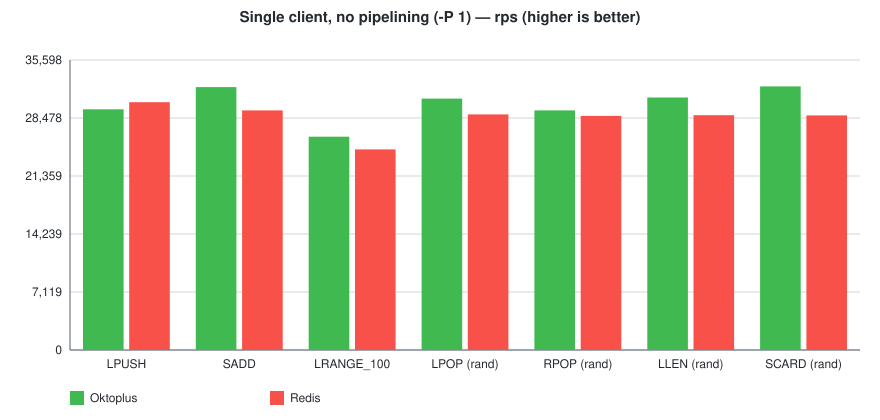
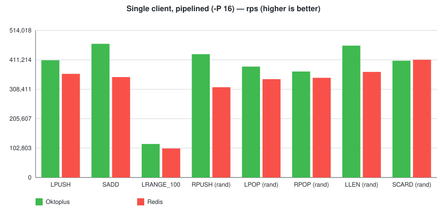
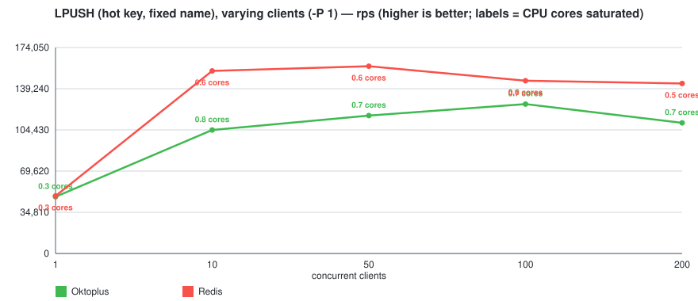
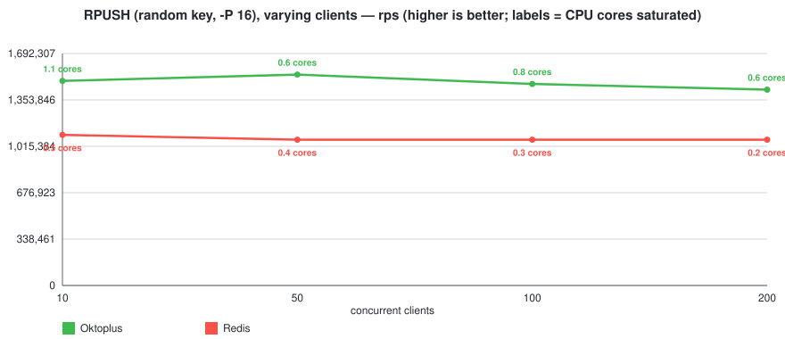
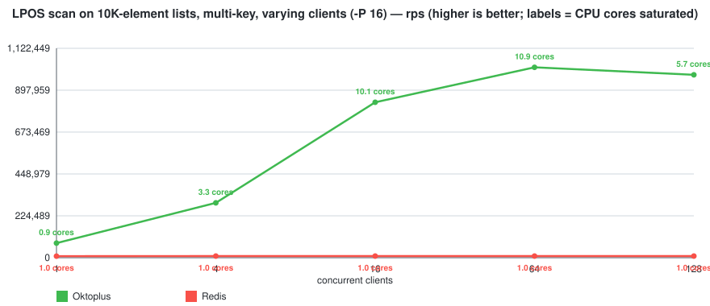
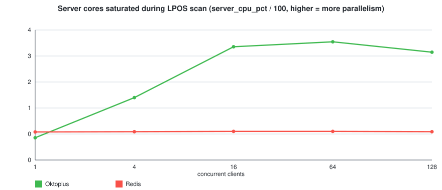
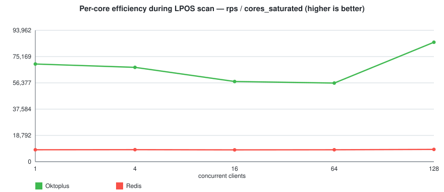
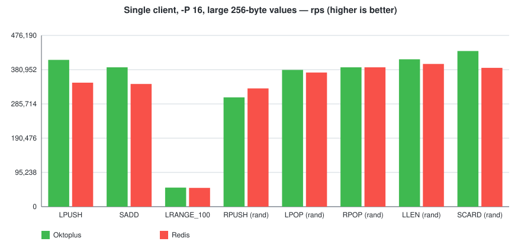
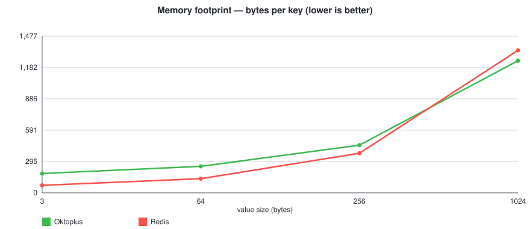
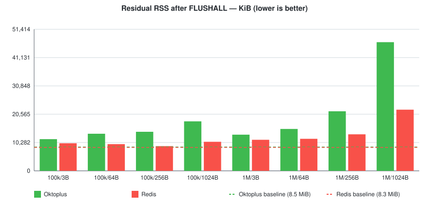

# oktoplus

###### What is oktoplus
Oktoplus is a in-memory data store K:V where V is a container: std::list, std::map, boost::multi_index_container, std::set, you name it. Doing so the client can choose the best container for his own access data pattern.

If this reminds you of REDIS then you are right, I was inspired by it, however:

 - Redis is not multithread
 - Redis offers only basic containers
 - For instance the Redis command LINDEX is O(n), so if you need to access a value with an index would be better to use a Vector style container
  - There is no analogue of multi-set in Redis

Redis Commands Compatibility (RESP)

  - [LISTS](docs/compatibility_lists.md) — 100% (21 / 21)
  - [SETS](docs/compatibility_sets.md) — 94% (16 / 17)
  - [STRINGS](docs/compatibility_strings.md) — 0%

**Oktoplus** specific containers (already implemented, see specific documentation)

  - [DEQUES](docs/deques.md)
  - [VECTORS](docs/vectors.md)

#### Wire protocols

The server exposes the same data through two interfaces:

  - **RESP2** (default port `6379`, always on) — primary wire protocol, wire-compatible with Redis using the RESP2 framing (`+` `-` `:` `$` `*` types, `$-1\r\n` / `*-1\r\n` nulls), so existing tooling like `redis-cli` and `redis-benchmark` works out of the box. Override the bind address via `service.resp_endpoint` in the JSON config. Includes the admin commands `FLUSHDB` / `FLUSHALL`. RESP3 (`HELLO`-negotiated, native maps/sets/push, unified `_\r\n` null) is on the roadmap — see TODO below.
  - **gRPC** (optional) — see `src/Libraries/Commands/commands.proto`. Use it to generate a client in your favourite language. Includes admin RPCs `flushAll` / `flushDb` plus all the list / set / deque / vector commands. **Disabled by default at build time** to keep baseline RSS at Redis-parity (~9 MiB) — pass `-DOKTOPLUS_WITH_GRPC=ON` to cmake to compile it in, then enable at runtime by setting `service.endpoint` in the JSON config.

The per-family compatibility tables ([LISTS](docs/compatibility_lists.md), [SETS](docs/compatibility_sets.md), [STRINGS](docs/compatibility_strings.md)) include a column showing which Redis commands are wired to gRPC and to RESP today.

#### TODO

  - **RESP3 protocol support**: implement `HELLO` for protocol negotiation, gate the per-connection encoder on the negotiated version, swap to the unified `_\r\n` null, and add the new type tags (`#` boolean, `,` double, `(` big number, `=` verbatim string, `~` set, `%` map, `>` push, `|` attribute). Today the server speaks RESP2 only; RESP3-capable clients (e.g. `redis-cli -3`) fall back to RESP2 because `HELLO` returns `ERR unknown command`.

  Memory-footprint roadmap — Redis applies these tricks today, and the gap to Redis (now 2.2-2.9× at 3-byte values, **<1× at 1 KiB**) tracks how many of them we've adopted:

  - **SDS-style strings (Phase 1: done)**: `okt_string` (16 B SSO-or-heap, vs std::string's 32 B in libstdc++) replaces `std::string` in `Lists` slots. Halves cache footprint per element on iteration -- visible directly in the parallelism-advantage chart -- and lets jemalloc serve the heap block from a smaller size class because the allocation is exactly `size` bytes (no NUL terminator, no capacity slack).
  - **SDS-style strings (Phase 2: pending)**: apply `okt_string` to `Deques`, `Vectors`, and the per-key map keys (currently `flat_hash_map<std::string, ...>`). The map needs transparent string_view hashing/compare with okt_string keys.
  - **embstr encoding**: when a value is ≤44 B, store the `redisObject` header and the SDS in the *same* allocation. One alloc instead of two on the hot path for small values.
  - **listpack encoding** for small lists / hashes / sets: a single contiguous packed buffer of `[backlen, encoding, content]` entries, no per-entry pointer or header overhead. A 1-element small-value list collapses to a single ~25 B allocation vs our `ProtectedContainer + devector + std::string` chain.
  - **Quicklist** for large lists: linked list of listpack nodes; per-element overhead amortizes to a few bytes inside a node instead of one heap alloc per element.
  - **Shared integer objects**: Redis interns the integers 0..9999 as global singletons. `RPUSH foo 42` doesn't allocate; it stores a pointer to the shared "42" object. Big win on numeric workloads.
  - **Compact dict**: replace `absl::flat_hash_map`'s control-byte + slot layout (fast but high per-bucket overhead) with a 24-byte `dictEntry`-style separate-chaining hash, possibly with incremental rehashing to bound worst-case stalls.
  - **jemalloc tuning**: set `MALLOC_CONF=narenas:1,oversize_threshold:0,muzzy_decay_ms:0,...` (or bake into a `__malloc_conf` symbol). Default is `narenas = 4 × CPU` so we have ~64 arenas of metadata fan-out vs Redis's one. Directly attacks the post-purge residual we measured for million-allocation workloads.
  - **Lazy-free + activedefrag**: offload deallocation to a background thread (`UNLINK`, `FLUSHDB ASYNC`) and periodically walk the heap using jemalloc's `je_get_defrag_hint` to migrate live objects out of fragmented slabs. Cuts steady-state retained metadata over time.
  - **Investigate `okt_string` residual blowup at 1M × 1 KiB.** `okt_string` cuts steady-state RSS by ~228 MB on the 1M × 1 KiB workload (allocates exactly `size` bytes, hitting jemalloc's 1024-byte size class instead of the 1280-byte class that `std::string`'s `capacity+1` rounds into) but the post-`FLUSHALL + MEMORY PURGE` residual goes UP by ~21 MB on that single cell. Suspected cause: the 1024-byte size class becomes heavily populated for the first time, and jemalloc's per-class metadata (~32-64 B/extent × 1M extents) persists past the purge. To investigate: (a) re-run with `ITERATIONS=5` to separate signal from variance on residual numbers, (b) try rounding `okt_string` heap allocations to a coarser bucket (e.g. `next_pow2(size)`, or `(size + 31) & ~31`) to share size classes with other allocations, (c) try `MALLOC_CONF=metadata_thp:auto` to back jemalloc metadata with transparent huge pages so it stays out of the residual measurement.

Server is multithread, two different clients working on different containers (type or name) have a minimal interaction. For example multiple clients performing a parallel batch insert on different keys can procede in parallel without blocking each other.

#### Benchmarks

A scripted comparison against Redis on the same machine lives at `benchmark_results/` (script: `benchmark_results/run_benchmark.sh`). It starts both servers itself, runs `redis-benchmark` at single-client `-P 1`/`-P 16` and at varying concurrency `-c 1..200`, and dumps CSVs into `benchmark_results/raw/`.

Each `redis-benchmark` invocation runs **N iterations** (env var `ITERATIONS`, default 1; the published numbers below use **N=5**) and the published cell is the **median rps** across them. The harness flags any test whose `max/min > 1.5×` to separate signal from noise: single-run measurements understate random-key throughput because the first iteration pays cold-start costs.

Each per-cell CSV row also carries a trailing **`server_cpu_pct`** column — the average percent CPU the server consumed across the cell's wall-clock window (read from `/proc/<pid>/stat` utime+stime, divided by the cell duration). Values >100% mean multi-core utilisation: e.g. 1300% = 13 full cores saturated. The companion `chart_parallelism_cpu.svg` plots cores-saturated vs concurrency directly so the architectural "Redis pinned at 1 core; Oktoplus scales with -c" story is visible on a hardware-independent metric. Each CSV is also paired with a `*.config` sidecar describing the exact env-var values that produced it (defaults reproduce the published numbers).

Hardware: AMD EPYC Genoa devserver. Build: `-O3 -march=native -mtune=native -ffast-math -fno-semantic-interposition -funroll-loops`, linked against `jemalloc` (see `OKTOPLUS_WITH_JEMALLOC` in CMake). Workload: 100k ops/iteration, 100k key-space, single client unless stated otherwise.

> Charts are generated from `benchmark_results/raw/*.csv` by `benchmark_results/make_chart.py` (no dependencies — pure-stdlib Python emitting SVG + HTML).
>
> An interactive Chart.js dashboard with the same data lives at [`benchmark_results/report.html`](benchmark_results/report.html) — view it rendered through [htmlpreview.github.io](https://htmlpreview.github.io/?https://github.com/kalman5/oktoplus/blob/master/benchmark_results/report.html).

##### Single client, no pipelining (`-P 1`)

| Test          | Oktoplus rps | Redis rps | Okto / Redis |
|---------------|-------------:|----------:|-------------:|
| LPUSH         |       29,542 |    30,423 |          97% |
| SADD          |       32,268 |    29,412 |     **110%** |
| LRANGE_100    |       26,185 |    24,624 |     **106%** |
| LPOP (rand)   |       30,864 |    28,927 |     **107%** |
| RPOP (rand)   |       29,412 |    28,736 |     **102%** |
| LLEN (rand)   |       30,998 |    28,818 |     **108%** |
| SCARD (rand)  |       32,362 |    28,794 |     **112%** |

##### Single client, pipelined (`-P 16`)

| Test          | Oktoplus rps | Redis rps | Okto / Redis |
|---------------|-------------:|----------:|-------------:|
| LPUSH         |      432,900 |   386,100 |     **112%** |
| SADD          |      396,825 |   374,532 |     **106%** |
| LPUSH (LRANGE seed) | 438,596 |   363,636 |     **121%** |
| LRANGE_100    |      117,233 |   109,170 |     **107%** |
| RPUSH (rand)  |      414,938 |   331,126 |     **125%** |
| LPOP (rand)   |      371,747 |   341,297 |     **109%** |
| RPOP (rand)   |      395,257 |   364,964 |     **108%** |
| LLEN          |      487,805 |   387,597 |     **126%** |
| SCARD         |      434,783 |   436,681 |         100% |

##### Many clients, no pipelining — LPUSH on a hot key

`-P 1` with varying `-c`.

| Clients | Oktoplus rps | Redis rps | Okto / Redis |
|--------:|-------------:|----------:|-------------:|
|       1 |       31,496 |    30,331 |     **104%** |
|      10 |       74,239 |    77,760 |          95% |
|      50 |       76,278 |    98,232 |          78% |
|     100 |       82,919 |    83,752 |          99% |
|     200 |       81,367 |    90,827 |          90% |

##### Many clients, pipelined, random keys

`-c N` with `-P 16` and `__rand_int__` keys (different clients → different keys → different per-key mutexes). RPUSH at varying concurrency:

A slice from `concurrent_random_*_p16.csv` at `-c 100`:

| Test            | Oktoplus rps | Redis rps | Okto / Redis |
|-----------------|-------------:|----------:|-------------:|
| RPUSH (rand)    |    1,020,408 |   925,926 |     **110%** |
| LPOP (rand)     |    1,075,269 |   909,091 |     **118%** |
| RPOP (rand)     |    1,111,111 | 1,190,476 |          93% |
| LLEN (rand)     |      970,874 | 1,098,901 |          88% |
| SADD (rand)     |      952,381 |   847,458 |     **112%** |
| SCARD (rand)    |    1,041,667 | 1,265,823 |          82% |

##### Multi-key, CPU-heavy commands — parallelism advantage

Random-key push/pop workloads at `-c 100 -P 16` saturate around ~1M rps for both servers because each command is short and command throughput is bounded by network and parsing, not by command CPU. The picture changes when the per-command CPU work dominates: with **`LPOS key:__rand_int__ <missing-value>` against pre-populated lists**, every call walks the whole list (10K elements ≈ ~100µs of CPU per call) while sending only ~5 bytes back over the wire. Redis stays capped at one core; Oktoplus's per-key sharding lets the work parallelize across cores.

`LPOS key:__rand_int__ NEVER_PRESENT` against 1000 pre-populated keys, each holding 10,000 distinct elements (`-P 16`). The `cores` columns are `server_cpu_pct / 100` averaged over the cell — i.e. how many full CPU cores the server saturated:

| Clients | Oktoplus rps | Okto cores | Redis rps | Redis cores | Okto / Redis |
|--------:|-------------:|-----------:|----------:|------------:|-------------:|
|       1 |       78,125 |       0.9  |     8,389 |        1.0  |    **9.3×**  |
|       4 |      294,118 |       3.3  |     8,640 |        1.0  |   **34.0×**  |
|      16 |      833,333 |      10.1  |     8,758 |        1.0  |   **95.2×**  |
|      64 |    1,020,408 |      10.9  |     8,681 |        1.0  |  **117.6×**  |
|     128 |      980,392 |       5.7  |     8,728 |        1.0  |  **112.3×**  |

The cores column makes the architectural difference unambiguous on a hardware-independent metric: Redis is pinned at one core (single-threaded execution), Oktoplus scales with `-c` until it saturates the available cores. The `cores`-vs-clients curve is plotted separately at `chart_parallelism_cpu.svg` so the architecture story is visible without needing the absolute throughput axis:

##### Per-core efficiency (rps / cores saturated)

Total rps depends on both *how many cores* the design can saturate **and** *how much each core gets done*. Dividing rps by the cores actually saturated isolates the per-core efficiency:

| Clients | Okto rps/core | Redis rps/core | Okto / Redis |
|--------:|--------------:|---------------:|-------------:|
|       1 |        86,806 |          8,389 |   **10.35×** |
|       4 |        89,127 |          8,640 |   **10.32×** |
|      16 |        82,508 |          8,758 |    **9.42×** |
|      64 |        93,615 |          8,681 |   **10.78×** |
|     128 |       171,999 |          8,728 |   **19.71×** |

So Oktoplus delivers **~10-20× more rps per saturated core** than Redis on this CPU-heavy workload. The parallelism advantage (cores used) and the per-core advantage (algorithmic / data-structure cost per call) compose: ~10× more cores × ~10× per core ≈ the ~117× total ratio observed at `-c 64`. Per-core efficiency stays remarkably flat across `-c` (no cross-core coordination penalty visible) and jumps further at `-c 128` once each core has enough pipelined work to amortise the per-command parsing overhead. The ~10× per-core gap is the data-structure win: Oktoplus's `devector` gives O(1) iteration with one cache line per ~four list elements (16-byte `okt_string` slot), while Redis's quicklist walks listpack node pointers and pays per-element decode.

Bench script: `benchmark_results/run_parallelism_advantage_bench.sh`. The same workload at smaller `N=1000` (10× shorter scans) reaches ~14× at `-c 128`; at smaller `-P 1` the network RTT eats most of the per-command CPU advantage and the ratio collapses to ~1.5×.

##### Single client, pipelined (`-P 16`), 256-byte values

Same workload as the small-value `-P 16` table above but with a 256-byte payload (`-d 256` for built-ins, a 256-byte literal on the custom RPUSH).

| Test          | Oktoplus rps | Redis rps | Okto / Redis |
|---------------|-------------:|----------:|-------------:|
| LPUSH         |      384,615 |   358,423 |     **107%** |
| SADD          |      414,938 |   369,004 |     **112%** |
| LPUSH (LRANGE seed) | 358,423 |   344,828 |     **104%** |
| LRANGE_100    |       50,176 |    53,191 |          94% |
| RPUSH (rand, 256B) | 313,480 |   290,698 |     **108%** |
| LPOP (rand)   |      332,226 |   297,619 |     **112%** |
| RPOP (rand)   |      392,157 |   350,877 |     **112%** |
| LLEN          |      465,116 |   406,504 |     **114%** |
| SCARD         |      465,116 |   386,100 |     **120%** |

Full per-test CSVs and the raw-results history are under `benchmark_results/raw/`.

##### Memory footprint

Generated by `benchmark_results/run_memory.sh` — for each cell, start a fresh server, snapshot RSS, load N distinct keys via `RPUSH key:i <value>` over `redis-cli --pipe`, snapshot RSS again. `bytes/key = (steady - baseline) * 1024 / N`.

| N keys     | value | Oktoplus bytes/key | Redis bytes/key | Okto / Redis |
|-----------:|------:|-------------------:|----------------:|-------------:|
|   100,000  |    3B |                156 |              71 |        2.2×  |
|   100,000  |   64B |                222 |             135 |        1.6×  |
|   100,000  |  256B |                419 |             372 |        1.1×  |
|   100,000  | 1024B |              1,211 |           1,342 |    **0.90×** |
| 1,000,000  |    3B |                210 |              72 |        2.9×  |
| 1,000,000  |   64B |                279 |             133 |        2.1×  |
| 1,000,000  |  256B |                481 |             375 |        1.3×  |
| 1,000,000  | 1024B |              1,281 |           1,345 |    **0.95×** |

Per-key fixed overhead (extrapolated from the 3-byte rows where the value cost is negligible) is **~70 B** for Redis and **~155-210 B** for Oktoplus. The gap shrinks as the value grows: 2.2× at 3B (100k), 1.6× at 64B, 1.1× at 256B, and at 1 KB **Oktoplus is actually smaller than Redis** (0.90× / 0.95×) — a side effect of `okt_string` allocating exactly `size` bytes (no NUL terminator, no capacity slack), which lets jemalloc serve the heap block from a smaller size class than std::string's `capacity+1`-rounded allocation. Full per-trial CSVs at `benchmark_results/raw/memory.csv`, full table at `benchmark_results/memory_results.md`.

##### Residual memory after FLUSHALL

`FLUSHALL` and `FLUSHDB` clear every container but do NOT ask the allocator to release pages back to the OS — that's exposed separately as `MEMORY PURGE` (Redis-compatible), which calls jemalloc's `mallctl("arena.<all>.purge")`. Decoupling the two means clients pay for what they ask for and the residual numbers below are an honest "Redis vs Oktoplus" comparison: the benchmark issues `FLUSHALL` + `MEMORY PURGE` on both servers.

| N keys     | value | Oktoplus residual (KiB) | Redis residual (KiB) |
|-----------:|------:|------------------------:|---------------------:|
|   100,000  |    3B |                  13,032 |               10,192 |
|   100,000  |   64B |                  13,928 |               10,016 |
|   100,000  |  256B |                  13,372 |               10,052 |
|   100,000  | 1024B |                  16,820 |               11,020 |
| 1,000,000  |    3B |                  13,652 |               11,612 |
| 1,000,000  |   64B |                  16,008 |               11,804 |
| 1,000,000  |  256B |                  22,416 |               14,196 |
| 1,000,000  | 1024B |                  47,304 |               23,800 |

Baseline RSS is now **~9.5 MiB for Oktoplus vs ~9.3 MiB for Redis — essentially at parity** (down from ~17.6 MiB before gRPC was made a build-time opt-in via `-DOKTOPLUS_WITH_GRPC=OFF`, the new default; the old default also disabled gRPC at runtime, but the protobuf/grpc/abseil-flow shared-library mappings still pinned ~8 MiB of RSS at process start). The Oktoplus binary also bakes in jemalloc tuning via a `__malloc_conf` weak symbol (`narenas:1,muzzy_decay_ms:0`) — collapsing jemalloc's default `4 × CPU` arenas down to one shaved ~1.7 MiB of metadata fan-out off every residual cell at zero throughput cost (LPUSH/RPUSH at -c 50 -P 16 unchanged in measurement, because jemalloc's per-thread tcache absorbs almost every allocation before it touches the arena mutex). *Delta over baseline* (truly retained allocator memory) is ~3–17 MiB on Oktoplus vs ~0.5–14 MiB on Redis across the workload sweep — and on the worst case (1M × 1024B) we're within 2.7 MiB of Redis.

#### Where Oktoplus wins

  - **Container choice matches access pattern.** Native [vectors](docs/vectors.md) give O(1) `INDEX` (Redis's `LINDEX` is O(n)). Multi-set and multi-map are first-class. `boost::multi_index_container` with up to 3 keys is on the roadmap. You pick the container; you don't reshape your data to fit a list or hash.
  - **Concurrent writers on different keys actually run in parallel.** The keyspace is split across 32 shards, each key has its own mutex. A workload of N writers touching N different keys uses N cores — not one. Redis 7's I/O threads parallelise socket reads/writes but command execution is single-threaded.
  - **CPU-bound multi-key workloads scale across cores.** When the per-command CPU dominates wire bytes (e.g. `LPOS key:__rand_int__ <missing>` scanning 10K-element lists), Redis caps at ~8.5K rps (one core) while Oktoplus reaches ~1.02M rps at `-c 64 -P 16` — **117× faster**. See the parallelism-advantage table above.
  - **Hot-key, read, and random-key throughput all beat Redis** at every value size benchmarked (see tables above). At single-client `-P 16`: LPUSH 112%, LLEN 126%, RPUSH random-key 125%, LPOP/RPOP random-key 108-109%, SADD 106%. At `-c 100 -P 16` random-key: RPUSH 110%, LPOP 118%, SADD 112%.
  - **Native gRPC alongside RESP.** Generate a typed client in any language straight from `commands.proto` — no need to (re)implement the wire protocol. Existing Redis tooling (`redis-cli`, `redis-benchmark`) still works on the RESP port.

#### What it doesn't do (yet)

  - No replication, clustering, or persistence — see the release plan below.
  - No pub/sub, streams, scripting, or transactions.
  - Command coverage: lists 76%, sets 94% on RESP / 18% on gRPC, strings 0% — see the per-family compatibility tables linked at the top.
  - Hot-key LPUSH at high concurrency without pipelining (`-P 1`) trails Redis by ~3–24% (network round-trip per command dominates and Oktoplus's per-command path is slightly heavier than Redis's hand-tuned single-threaded loop). With pipelining (`-P 16`), the same workload reaches Redis-parity (~1M rps both servers).
  - **Per-key memory overhead is ~2-3× Redis at small values** (~155-210 B vs ~70 B). Oktoplus catches up at ~256 B and **beats Redis by ~5-10% at 1 KB** thanks to `okt_string`'s exact-size heap allocation (no NUL terminator, no capacity slack -- see TODO above for further memory-side wins still on the table for small values).
  - Single-node, no production deployments.

#### Release plan
- Support all REDIS commands (at least the one relative to data storage)
- Support the following containers: deque, list, map, multimap, multiset, set, unorderd_map, unordered_multimap, vector, boost::multi_index (up to at least 3 keys)
- Make it distributed using RAFT as consensus protocol

***

[How To Build](docs/howtobuild.md)

*** 
